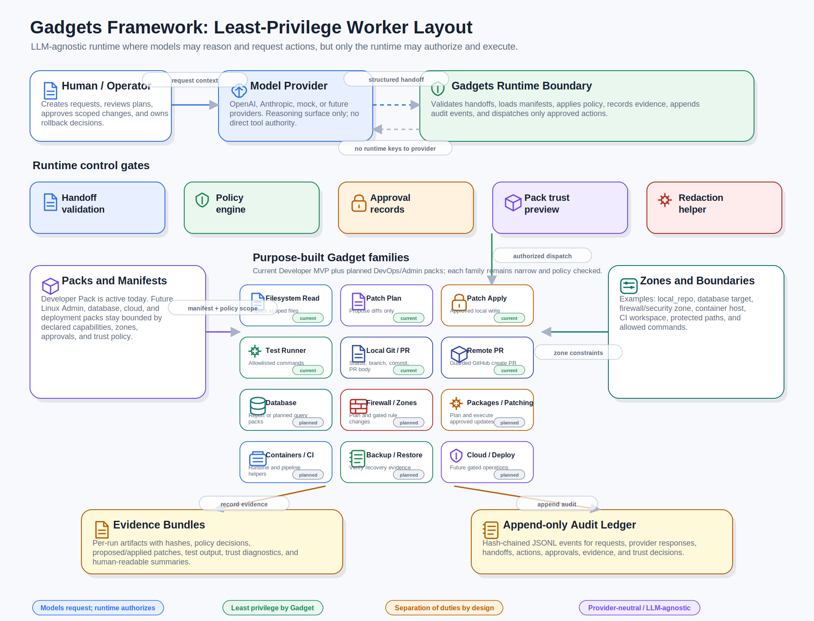
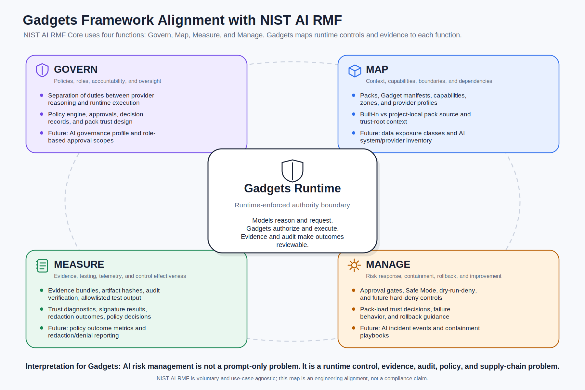

# Gadgets Framework

Gadgets Framework is a safety-first, LLM-agnostic framework for building purpose-built AI workers called Gadgets.

A Gadget is a narrowly scoped worker that can help with a specific kind of task, such as inspecting a repository, planning a patch, summarizing evidence, or preparing a controlled change. The important boundary is that a model does not get direct authority to act. A model may reason, propose, summarize, and request an action, but the Gadgets runtime decides whether that action is allowed.




## Why this exists

General-purpose AI agents are powerful, but broad authority is risky. A single agent with unrestricted tools, filesystem access, shell access, cloud credentials, database credentials, or deployment permissions can become difficult to reason about, test, audit, or safely operate.

Gadgets Framework takes the opposite approach:

- split work into small, purpose-built roles
- grant each role only the capabilities it needs
- keep actions inside explicit zones
- require policy checks before meaningful work
- record evidence for what happened
- maintain an audit trail for accountability
- treat provider output as untrusted input to the runtime

The framework is designed for environments where AI assistance needs to be useful without becoming an uncontrolled automation layer.

## Core idea

The central rule is simple:

```text
Models can request. The runtime authorizes and executes.
```

Provider APIs, model tool-calling features, prompt conventions, and agent handoff mechanisms are useful integration surfaces, but they are not the security boundary. The runtime remains responsible for deciding what can happen.

## LLM-agnostic by design

Gadgets Framework is not tied to one model vendor or one provider API. A provider can supply reasoning, plans, summaries, or structured handoff requests, but the surrounding safety model remains the same.

This makes it possible to use different model providers while preserving a consistent runtime contract for:

- capabilities
- zones
- handoffs
- approvals
- evidence
- audit
- policy decisions
- pack and Gadget manifests

The model is replaceable. The authority boundary is not.

## Least privilege and separation of duties

Gadgets are intended to follow least privilege. Instead of one broad agent that can do everything, work is divided into narrow Gadgets with explicit permissions.

For example, one Gadget may be allowed to inspect files, another may be allowed to propose a patch, another may be allowed to verify an approval, and another may be allowed to run a named test command. Each action is checked by the runtime before it occurs.

This separation of duties mirrors long-standing practices in cybersecurity, governance, and compliance:

- identity and access management separates identity from authorization
- role-based and attribute-based access control limit what a role can do
- zero trust architecture assumes every request must be evaluated
- change management separates request, review, approval, and execution
- audit logging records activity for accountability and investigation
- evidence collection supports review, compliance, and incident response
- supply-chain controls distinguish trusted components from untrusted ones

Gadgets Framework applies similar ideas to AI-assisted work.

## Key concepts

### Gadget

A purpose-built worker with a defined role, manifest, capabilities, and boundaries.

### Pack

A collection of related Gadgets, manifests, and policy expectations for a task family.

### Zone

A scoped area where work may occur, such as a local repository or another explicitly defined target.

### Handoff

A structured request from one role to another. Handoffs are policy-checked and do not automatically grant authority.

### Policy

The runtime decision layer that evaluates whether a requested action is allowed.

### Approval

A bounded authorization record for sensitive work. Approvals are intended to bind tightly to scope, evidence, and the exact action being approved.

### Evidence

Artifacts that explain what was requested, what was evaluated, what happened, and what outputs were produced.

### Audit ledger

An append-only record of important decisions and events. The audit ledger is intended to support accountability and tamper-evident review.


## Alignment with the NIST AI RMF

The [NIST AI Risk Management Framework](https://www.nist.gov/itl/ai-risk-management-framework) describes a voluntary approach for managing AI risk. Its Core is organized around four functions: Govern, Map, Measure, and Manage. Gadgets Framework is not a compliance certification, but its architecture lines up naturally with that operating model because it treats AI-assisted work as a runtime governance problem, not only a prompting problem.



In Gadgets Framework, governance is represented by policies, approvals, separation of duties, and pack trust. Mapping is represented by explicit capabilities, zones, manifests, provider profiles, and dependency boundaries. Measurement is represented by evidence bundles, test results, signature diagnostics, redaction outcomes, and audit verification. Management is represented by Safe Mode, approval gates, dry-run controls, rollback guidance, and future hard-deny enforcement for unsafe or untrusted operations.

## What Gadgets Framework is not

Gadgets Framework is not intended to be a generic root shell for AI. It is not a way to let provider-side tool calls bypass local policy. It is not a replacement for human approval, secure engineering practices, change control, or compliance programs.

The goal is to make AI-assisted work safer and more governable by keeping authority inside a runtime that can be reviewed, tested, audited, and constrained.

## Repository layout

```text
crates/     Rust workspace crates for the runtime and supporting components.
docs/       Architecture notes, design records, project planning, and guides.
examples/   Example project configuration and local runtime layouts.
packs/      Built-in pack and Gadget manifest definitions.
specs/      Contract specifications for manifests, capabilities, zones, handoffs, evidence, audit, providers, and packs.
```

## Documentation

Start with:

- `docs/ARCHITECTURE.md` for the high-level architecture
- `specs/` for contract-level specifications
- `docs/DECISION_RECORD.md` for design decisions

## License and author

Gadgets Framework is dual-licensed under MIT OR Apache-2.0, at your option.

- MIT License: see `LICENSE-MIT`
- Apache License, Version 2.0: see `LICENSE-APACHE`
- Dual-license summary: see `LICENSE.md`

Author: Richard S. Westmoreland <dev@rswestmore.land>

Copyright 2026 Richard S. Westmoreland
